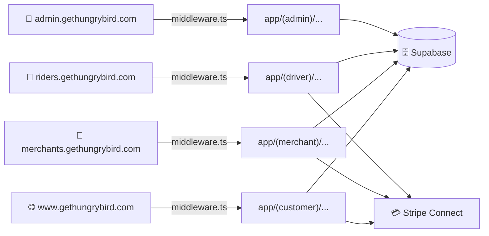

<![CDATA[<div align="center">

# 🐦 GetHungryBird.com

### Production Roadmap

**12 Sprints · 4 Phases · From Prototype to Launch**

`Next.js 16` · `Supabase` · `Stripe Connect` · `PostGIS` · `Vercel`

---

</div>

> **📋 How to use this doc:** Each sprint is a self-contained "card" with a clear goal, a checklist of deliverables, code examples where needed, and a ✅ **Done When** block at the end. Work through them in order. Each sprint produces a fully working product.

---

## 📊 Prototype Audit — What Exists Today

```
✅ BUILT                          ⚠️ PARTIAL                    ❌ MISSING
─────────────────────────────    ─────────────────────────────  ───────────────────────────
Customer Views (7 screens)       Static Data (hardcoded JSON)   Authentication
Smart Swap Engine                Next.js Config (static export) Database Integration
Logistics Simulator                                             API Routes
UI Shell + Navigation                                           Merchant Portal (empty)
                                                                Driver Portal (empty)
                                                                Admin Portal (empty)
                                                                Middleware (subdomain routing)
                                                                Payments
```

---

## 🏗️ Architecture



> All four subdomains served from **one Next.js codebase**, routed via `middleware.ts`.

---

## 🚨 Founder Warnings — Read Before You Code

> [!CAUTION]
> Three mistakes that will cost you **weeks** if you get them wrong. All three are already woven into the sprint instructions below.

<table>
<tr>
<td width="33%">

### 💳 Warning #1
**Use Stripe Connect, Not Standard Stripe**

❌ Standard Stripe: All $20 goes to *your* account. You manually split money, handle 1099 tax forms, and owe taxes on full revenue.

✅ **Stripe Connect Express**: Auto-splits payments. $15 → Restaurant, $3 → Driver, $2 → You. Stripe files their 1099s.

📍 *Sprints 3, 5, 7, 9*

</td>
<td width="33%">

### 🔒 Warning #2
**Prevent Double-Assignment Race Conditions**

❌ Naive: Two drivers tap "Accept" simultaneously → both assigned the same batch.

✅ **Atomic SQL**: `UPDATE ... SET driver_id = ? WHERE id = ? AND driver_id IS NULL`. Second driver gets 0 rows → shown "Already claimed."

📍 *Sprint 8*

</td>
<td width="33%">

### 🗺️ Warning #3
**Geocode Once, Query Free**

❌ On-the-fly: Geocode 50 restaurants per page load = **$50/day** at 1K users.

✅ **Geocode once** on address save → store `lat/lng`. Use **PostGIS `ST_DWithin()`** for all distance queries (free). Google Maps only for turn-by-turn nav links.

📍 *Sprints 2, 3, 4, 8, 9*

</td>
</tr>
</table>

---

## 💰 Setup Costs

| Item | Cost | Notes |
|:-----|:----:|:------|
| Domain `gethungrybird.com` | ~$12/yr | Already owned |
| Vercel Pro | $20/mo | Required for wildcard subdomains |
| Supabase (DB + Auth) | Free | 500MB DB, 50K MAU auth, 2M edge functions — **auth is built-in** |
| Stripe Connect | Free | Pay-as-you-go transaction fees only |

---

<div align="center">

# Phase 1 — Foundation & Infrastructure

`Sprint 1` · `Sprint 2` · `Sprint 3`

</div>

---

## 🏃 Sprint 1 — Remove Static Export & Build the Traffic Controller

> **🎯 Goal:** The app can run server-side. Subdomains route to different portals.

### Step 1 · Switch to Server Mode

> [!CAUTION]
> This is a **breaking change.** The app currently uses `output: 'export'` — no SSR, no API routes, no middleware. Everything else depends on this.

- [ ] **Edit** `next.config.mjs`
  - Remove `output: 'export'`
  - Remove `images: { unoptimized: true }`
- [ ] Run `npm run build` → should produce `.next/` server build, not `out/` static folder
- [ ] Fix any `'use client'` issues that surface

### Step 2 · Configure DNS

- [ ] Add CNAME record: `*.gethungrybird.com` → `cname.vercel-dns.com`
- [ ] In Vercel Dashboard → Domains, add:
  - `gethungrybird.com`
  - `www.gethungrybird.com`
  - `merchants.gethungrybird.com`
  - `riders.gethungrybird.com`
  - `admin.gethungrybird.com`
- [ ] Verify all subdomains resolve with SSL ✅

### Step 3 · Create `middleware.ts`

> **📁 New File:** `middleware.ts` (project root)

```
Request comes in → extract hostname → determine subdomain:

  "merchants" → rewrite to /merchant/...
  "riders"    → rewrite to /driver/...
  "admin"     → rewrite to /admin/...
  default     → passthrough (customer routes)

Use NextResponse.rewrite() for transparent routing.
```

- [ ] Add `matcher` config to skip static assets
- [ ] Verify: `merchants.gethungrybird.com` shows different content than `www`

### Step 4 · Create Portal Placeholders

| New File | Content |
|:---------|:--------|
| `app/(merchant)/layout.js` | Basic layout wrapper, merchant branding |
| `app/(merchant)/dashboard/page.js` | "Welcome to the Merchant Portal" |
| `app/(merchant)/menu/page.js` | Placeholder |
| `app/(merchant)/settings/page.js` | Placeholder |
| `app/(driver)/layout.js` | Mobile-first layout |
| `app/(driver)/dashboard/page.js` | "Rider Dashboard" |
| `app/(admin)/layout.js` | Admin layout |
| `app/(admin)/page.js` | "Admin Panel" |

<br>

> [!TIP]
> ### ✅ Done When
> You visit `merchants.gethungrybird.com` → see "Restaurant Partner Portal."
> You visit `riders.gethungrybird.com` → see "Rider Dashboard."
> `www.gethungrybird.com` → loads the existing customer app exactly as before.

---

## 🏃 Sprint 2 — Database Schema & Authentication

> **🎯 Goal:** Real data lives in Supabase. Users can sign in with role-based access.

### Step 1 · Set Up Supabase

- [ ] Create project at [supabase.com](https://supabase.com)
- [ ] Create `.env.local`:
  ```env
  NEXT_PUBLIC_SUPABASE_URL=https://xxxxx.supabase.co
  NEXT_PUBLIC_SUPABASE_ANON_KEY=eyJ...
  SUPABASE_SERVICE_ROLE_KEY=eyJ...    # Server-only, NEVER expose to client
  ```
- [ ] Confirm `.env.local` is in `.gitignore`

### Step 2 · Create the Database Schema

> [!IMPORTANT]
> Notice the `lat`/`lng` fields, `stripe_account_id`, and `geography` types — these support the Founder Warnings above.

| Table | Key Columns | Notes |
|:------|:------------|:------|
| **`profiles`** | `id` (FK→auth.users), `role`, `full_name`, `phone`, `avatar_url`, `stripe_account_id`, `created_at` | User metadata + Stripe Connect link |
| **`restaurants`** | `id`, `owner_id`, `name`, `address`, **`lat`**, **`lng`**, `logo_url`, `is_online`, `operating_hours`, `stripe_account_id` | 🗺️ *lat/lng geocoded once at creation* |
| **`menu_items`** | `id`, `restaurant_id`, `name`, `price`, `image_url`, `meal_time[]`, `cuisine`, `dietary` (jsonb), calories/protein/carbs/fat, `allergens[]`, `tags[]`, `is_available` | Replaces `data/meals.js` |
| **`orders`** | `id`, `student_id`, `restaurant_id`, `driver_id`, `status`, `items` (jsonb), `subtotal`, `delivery_fee`, `tax`, `total`, `platform_fee`, **`stripe_payment_intent_id`**, **`stripe_transfer_group`** | Order lifecycle + Stripe tracking |
| **`order_items`** | `id`, `order_id`, `menu_item_id`, `quantity`, `price_at_order` | Line items |
| **`drivers`** | `id`, `vehicle_type`, `license_plate`, `is_online`, **`location`** (geography), `current_batch_id`, `stripe_account_id` | 🗺️ *PostGIS geography type* |
| **`delivery_batches`** | `id`, **`driver_id`** (nullable!), `orders[]`, `status`, `pickup_restaurant_id` | 🔒 *driver_id starts NULL for atomic claim* |
| **`addresses`** | `id`, `user_id`, `label`, `address`, **`lat`**, **`lng`**, `type`, `meal_times` (jsonb) | 🗺️ *lat/lng geocoded once on save* |

### Step 2b · Enable PostGIS

```sql
-- Run in Supabase SQL editor
CREATE EXTENSION IF NOT EXISTS postgis;

-- Helper function: "restaurants within X miles"
CREATE OR REPLACE FUNCTION nearby_restaurants(
  user_lat float8, user_lng float8, radius_miles float8
) RETURNS SETOF restaurants AS $$
  SELECT * FROM restaurants
  WHERE is_online = true
  AND ST_DWithin(
    ST_MakePoint(lng, lat)::geography,
    ST_MakePoint(user_lng, user_lat)::geography,
    radius_miles * 1609.34  -- miles → meters
  )
$$ LANGUAGE sql;
```

### Step 2c · Row Level Security (RLS)

- [ ] Enable RLS on **every table**

| Table | Policy |
|:------|:-------|
| `profiles` | Users read/update own. Admins read all. |
| `restaurants` | Merchants CRUD own. Students read `is_online = true`. |
| `menu_items` | Merchants CRUD for their restaurant. Students read `is_available = true`. |
| `orders` | Students own. Merchants see their restaurant's. Drivers see assigned. Admins see all. |
| `drivers` | Drivers update own. Admins read all. |
| `delivery_batches` | Drivers claim where `driver_id IS NULL`. Admins read all. |

### Step 3 · Supabase Client Library

| New File | Purpose |
|:---------|:--------|
| `lib/supabase/client.js` | Browser client (anon key) |
| `lib/supabase/server.js` | Server client (service role key) |
| `lib/supabase/middleware.js` | Auth session refresh in middleware |

### Step 4 · Integrate Supabase Auth

> [!NOTE]
> Using Supabase Auth (not Clerk) — keeps auth + data in one place, and RLS works automatically.

| New File | Purpose |
|:---------|:--------|
| `app/(auth)/login/page.js` | Login — variant per subdomain (Student / Merchant / Driver) |
| `app/(auth)/signup/page.js` | Registration with auto-set role |
| `lib/auth.js` | Helpers: `getCurrentUser()`, `requireRole()`, `signOut()` |

- [ ] **Update** `middleware.ts` — add auth session refresh + role-based redirects
  - `role: student` visits `merchants.*` → redirect with "Unauthorized"
  - Unauthenticated on protected route → redirect to login

### Step 5 · Auth Provider

| New File | Purpose |
|:---------|:--------|
| `components/providers/AuthProvider.js` | Provides `user`, `session`, `role`, `isLoading` via Context |

- [ ] **Update** `app/layout.js` — wrap `<AppProvider>` inside `<AuthProvider>`

<br>

> [!TIP]
> ### ✅ Done When
> You sign up as a merchant at `merchants.gethungrybird.com/signup` → get a `profiles` row with `role: merchant`. Visit `riders.gethungrybird.com` → redirected with "Unauthorized." Main app at `www` requires login.

---

## 🏃 Sprint 3 — Merchant Dashboard (Supply Side)

> **🎯 Goal:** Merchants can log in, set up their restaurant, and manage their menu. This data replaces the static `data/meals.js`.

### Step 1 · Merchant Onboarding Wizard

> **📁 New File:** `app/(merchant)/onboarding/page.js`

**4-step wizard:**

| Step | What Happens |
|:-----|:-------------|
| 1️⃣ **Restaurant Info** | Name, Address, Phone, Cuisine → **geocode address once** via `app/api/geocode/route.js` → store `lat/lng` |
| 2️⃣ **Branding** | Logo upload (Supabase Storage → `restaurant-logos` bucket), Description, Operating Hours |
| 3️⃣ **Stripe Connect** | `stripe.accounts.create({ type: 'express' })` → redirect to Stripe's hosted form → save `stripe_account_id` |
| 4️⃣ **Confirmation** | Preview card → "Your restaurant is live!" |

- [ ] On submit: insert `restaurants` row with `lat`, `lng`, `stripe_account_id`
- [ ] If merchant already has a restaurant → skip to dashboard

> [!IMPORTANT]
> **🗺️ Geocode-Once Rule:** Address is geocoded exactly *once* during onboarding (and again if edited). All subsequent distance queries use stored coordinates via PostGIS — zero Google API calls.

### Step 2 · Menu CRUD

> **📁 File:** `app/(merchant)/menu/page.js`

- [ ] List all `menu_items` grouped by meal time (Breakfast / Lunch / Dinner)
- [ ] **Add Item Form:** Name, Description, Price, Meal Time (multi-select), Cuisine, Dietary flags, Macros, Allergens, Image upload, Tags
- [ ] Edit / Delete / Toggle availability per item
- [ ] Field names must match `data/meals.js` structure → `SwapLogistics.js` works without changes

### Step 3 · Merchant Dashboard

> **📁 File:** `app/(merchant)/dashboard/page.js`

- [ ] Store Status toggle — "Accepting Orders" (updates `restaurants.is_online`)
- [ ] Quick Stats: menu items, orders today, revenue today
- [ ] Recent Orders section (empty state for now)

### Step 4 · Merchant Settings

> **📁 File:** `app/(merchant)/settings/page.js`

- [ ] Edit restaurant info, account settings, "Pause Restaurant" / "Delete Account"

### Step 5 · Seed Script

> **📁 New File:** `scripts/seed.mjs`

```bash
# Parse data/meals.js + data/vendors.js → insert into Supabase
node scripts/seed.mjs
```

- [ ] Creates `restaurants` rows + dummy `profiles` rows
- [ ] Creates `menu_items` rows linked to correct restaurants
- [ ] Verify in Supabase dashboard → same meals as prototype

<br>

> [!TIP]
> ### ✅ Done When
> A merchant logs into `merchants.gethungrybird.com`, completes onboarding (including Stripe Connect), uploads a "Spicy Chicken Sandwich" at $12.99, and toggles "Online." The seed script has populated the DB with all prototype meals.

---

<div align="center">

# Phase 2 — The Transaction Loop

`Sprint 4` · `Sprint 5` · `Sprint 6`

</div>

---

## 🏃 Sprint 4 — Connect Student Feed to Real Data

> **🎯 Goal:** Students see live restaurant data from the database, not from `data/meals.js`.

### Step 1 · API Routes

| New File | Endpoint | Notes |
|:---------|:---------|:------|
| `app/api/restaurants/route.js` | `GET ?lat=&lng=&radius=2` | Uses PostGIS `nearby_restaurants()` — **zero Google API calls** |
| `app/api/menu/route.js` | `GET ?restaurant_id=` or `?meal_time=&cuisines=` | Filtered queries for schedule engine |
| `app/api/menu/search/route.js` | `GET ?q=chicken` | Full-text search |
| `app/api/geocode/route.js` | `POST { address }` → `{ lat, lng }` | **The ONLY place Google Geocoding is called** — results stored in DB |

### Step 2 · Data Hooks

| New File | Purpose |
|:---------|:--------|
| `hooks/useRestaurants.js` | Fetch `/api/restaurants` with SWR |
| `hooks/useMenuItems.js` | Fetch `/api/menu` with filters |
| `hooks/useUser.js` | Wrap auth context for easy access |

### Step 3 · Refactor Customer Views

> This is the **critical migration step.** Replace all `import { MEALS }` with API calls.

| File to Update | Change |
|:---------------|:-------|
| `components/views/ScheduleView.jsx` | Replace `MEALS` import → `useMenuItems()` hook |
| `components/views/DashboardView.jsx` | Replace mock history → real order history from DB |
| `components/providers/AppProvider.js` | Extract schedule logic to `lib/schedule.js`, add `dataSource: 'api'` flag. **Don't rewrite the whole file.** |
| `utils/SwapLogistics.js` | Change to accept meals as parameter: `findSmartSwap(currentMealType, currentSchedule, context, meals)` |

### Step 4 · Geolocation in Student Feed

- [ ] Request browser location on `DashboardView`
- [ ] Pass `lat/lng` to `/api/restaurants?lat=...&lng=...&radius=2`
- [ ] API uses **PostGIS `ST_DWithin()`** — no Google Distance Matrix
- [ ] Client-side: calculate Haversine distance in JS → show "Within 2 miles" badge (pure math, **free**)
- [ ] Fallback: no permission → show all restaurants sorted by popularity

<br>

> [!TIP]
> ### ✅ Done When
> Toggle "Offline" on `merchants.gethungrybird.com` → restaurant instantly disappears from `www`. The schedule still generates meals via Smart Swap Engine, but now from live database data.

---

## 🏃 Sprint 5 — Ordering & Payments (Green Mode)

> **🎯 Goal:** A student can pay real money for a meal. Green Mode density-based pricing is live.

### Step 1 · Cart & Checkout Flow

| New File | Purpose |
|:---------|:--------|
| `components/Cart.jsx` | Slide-out: line items, delivery fee (Green/Yellow/Red), tax, total |
| `app/(customer)/checkout/page.js` | Order summary, address selection, delivery time |

### Step 2 · Stripe Connect Integration

> [!CAUTION]
> **Do NOT use standard Stripe.** You are a marketplace. Use **Stripe Connect** so payments are automatically split between you, the restaurant, and the driver. Stripe also handles 1099 tax forms.

**Add to `.env.local`:**
```env
STRIPE_SECRET_KEY=sk_test_...
NEXT_PUBLIC_STRIPE_PUBLISHABLE_KEY=pk_test_...
STRIPE_WEBHOOK_SECRET=whsec_...
```

| New File | Purpose |
|:---------|:--------|
| `app/api/stripe/connect/route.js` | `POST` — Create Connect account link · `GET` — Check onboarding status |
| `app/api/checkout/route.js` | Create Checkout Session with payment splitting (see below) |
| `app/api/webhooks/stripe/route.js` | Handle `checkout.session.completed` + `account.updated` |

**💳 Payment splitting — how it works:**

```js
// 1. Create Checkout Session with transfer group
const session = await stripe.checkout.sessions.create({
  line_items: [/* meal items, delivery fee, tax */],
  payment_intent_data: {
    transfer_group: `order_${orderId}`,
  },
  // ...
});

// 2. After payment succeeds → transfer restaurant's share
await stripe.transfers.create({
  amount: restaurantShareCents,   // $15.00 → 1500
  currency: 'usd',
  destination: restaurant.stripe_account_id,
  transfer_group: `order_${orderId}`,
});
// Driver transfer happens after delivery (Sprint 9)
```

**💰 Money flow:**

```
Student pays $20
  └→ $20 lands in YOUR platform Stripe account
      ├→ $15 auto-transferred to Restaurant's connected account
      ├→ $3 transferred to Driver after delivery (Sprint 9)
      └→ $2 stays in your account (platform fee)
```

### Step 3 · Green Mode Pricing

| New File | Purpose |
|:---------|:--------|
| `lib/logistics.js` | Shared density calculation module (server + client) |
| `lib/payments.js` | Stripe Connect helpers: `calculatePlatformFee()`, `createRestaurantTransfer()`, `createDriverTransfer()`, `refundOrder()` |

**Delivery fee tiers:**

| Mode | Neighbors | Fee |
|:-----|:---------:|:---:|
| 🟢 Green | 10+ | **$0.00** |
| 🟡 Yellow | 4–9 | $1.99 |
| 🔴 Red | 1–3 | $7.99 |

### Step 4 · Order Success & Tracking

| New / Updated File | Purpose |
|:-------------------|:--------|
| `app/(customer)/checkout/success/page.js` | "Your order has been placed! 🎉" + order number |
| `components/views/HistoryView.jsx` *(update)* | Replace mock data with real orders, show status badges |

<br>

> [!TIP]
> ### ✅ Done When
> Student selects a meal → sees "$0.00 delivery" (Green Mode) → pays $15.99 via Stripe Connect → $12.00 **automatically transferred** to restaurant's Stripe account → $2.00 platform fee stays → order row in Supabase with `status: CONFIRMED` and `stripe_transfer_group`.

---

## 🏃 Sprint 6 — Kitchen Display System (KDS)

> **🎯 Goal:** Merchants see incoming orders in real-time and manage them through prep stages.

### Step 1 · KDS View

> **📁 New File:** `app/(merchant)/orders/page.js`

**Kanban-style layout:**

```
┌──────────────┐  ┌──────────────┐  ┌──────────────────┐
│  🔴 NEW      │  │  🟡 PREPARING │  │  🟢 READY        │
│              │  │              │  │                  │
│  Order #142  │──│  Order #139  │──│  Order #137      │
│  2x Chicken  │  │  1x Burrito  │  │  3x Tacos        │
│  [Confirm]   │  │  [Mark Ready]│  │  Waiting for     │
│              │  │              │  │  driver...        │
└──────────────┘  └──────────────┘  └──────────────────┘
```

### Step 2 · Real-Time Updates

**Recommended: Supabase Realtime (not polling)**

```js
supabase
  .channel('orders')
  .on('postgres_changes', {
    event: 'INSERT',
    schema: 'public',
    table: 'orders',
    filter: `restaurant_id=eq.${myRestaurantId}`
  }, handleNewOrder)
  .subscribe();
```

### Step 3 · Merchant API Routes

| New File | Endpoint |
|:---------|:---------|
| `app/api/merchant/orders/route.js` | `GET` — Fetch orders by status · `PATCH` — Update status |
| `app/api/merchant/stats/route.js` | `GET` — Today's orders, revenue, popular items |

### Step 4 · Sound & Visual Alerts

- [ ] 🔊 Play notification sound on new order (Web Audio API)
- [ ] 📌 Flash browser tab: "🔴 New Order! — HungryBird Merchant"
- [ ] 🔔 Toast notification at top of KDS

### Step 5 · Update Dashboard

- [ ] Wire up Quick Stats with real data from `/api/merchant/stats`
- [ ] Add "View Kitchen Orders →" link

<br>

> [!TIP]
> ### ✅ Done When
> Student orders on `www` → Merchant screen at `merchants.*/orders` flashes "New Order!" with a sound → Merchant clicks "Confirm" → "Mark Ready" → status updates in real-time on both merchant KDS and student's order history.

---

<div align="center">

# Phase 3 — Logistics Network

`Sprint 7` · `Sprint 8` · `Sprint 9`

</div>

---

## 🏃 Sprint 7 — The Rider Portal (PWA)

> **🎯 Goal:** Drivers have a mobile-first app at `riders.gethungrybird.com` that works like a native app.

### Step 1 · Mobile-First Layout + PWA

> **📁 File:** `app/(driver)/layout.js`

- [ ] Full-screen mobile layout — no desktop sidebar
- [ ] Bottom tabs: Dashboard | Active Delivery | Earnings | Settings
- [ ] **New File:** `public/manifest.json` — `name: "HungryBird Rider"`, `display: "standalone"`
- [ ] **Update** `app/layout.js` — add `<link rel="manifest">` (conditionally for driver subdomain)

### Step 2 · Driver Onboarding (+ Stripe Connect)

> **📁 New File:** `app/(driver)/onboarding/page.js`

| Step | What Happens |
|:-----|:-------------|
| 1️⃣ **Personal Info** | Name, phone, photo |
| 2️⃣ **Vehicle Details** | Type (bicycle/car/scooter), license plate |
| 3️⃣ **Stripe Connect** | Same Express flow as merchants → `stripe_account_id` saved to `drivers` + `profiles` |
| 4️⃣ **Terms** | Accept terms → "Start Driving" |

### Step 3 · Driver Dashboard

> **📁 File:** `app/(driver)/dashboard/page.js`

- [ ] 🟢 Big Toggle: "Go Online" / "Go Offline" (updates `drivers.is_online`)
- [ ] Status card: online duration, earnings today, deliveries completed
- [ ] Available Batches list (populated by Sprint 8)
- [ ] Map showing current location

### Step 4 · Settings & Earnings

| New File | Purpose |
|:---------|:--------|
| `app/(driver)/settings/page.js` | Edit vehicle, phone |
| `app/(driver)/earnings/page.js` | Weekly/daily earnings, per-delivery breakdown |

<br>

> [!TIP]
> ### ✅ Done When
> Driver visits `riders.gethungrybird.com` on Safari → saves to Home Screen → opens native-feeling app → completes onboarding (including Stripe Connect) → toggles "Online." Status reflected in `drivers` table.

---

## 🏃 Sprint 8 — The Dispatcher (Order Assignment)

> **🎯 Goal:** When a merchant marks orders "Ready for Pickup," the system batches and assigns them to drivers.

> [!IMPORTANT]
> **🔒 Race Condition Prevention:** This sprint uses atomic SQL updates to prevent two drivers from claiming the same batch. This is Founder Warning #2.

### Step 1 · Dispatching Engine

> **📁 New File:** `lib/dispatcher.js`

**Batching logic:**

```
1. Query orders WHERE status = 'READY_FOR_PICKUP', grouped by restaurant_id
2. Create batch in delivery_batches with driver_id = NULL, status = 'PENDING'
3. Find nearest online drivers using PostGIS (not Google):
```

```sql
SELECT id, ST_Distance(
  location::geography,
  ST_MakePoint(restaurant_lng, restaurant_lat)::geography
) AS distance_meters
FROM drivers
WHERE is_online = true AND current_batch_id IS NULL
ORDER BY distance_meters ASC
LIMIT 5;
```

```
4. NOTIFY the nearest drivers (do NOT auto-assign — let them accept/decline)
```

### Step 2 · Dispatch API (with Atomic Claim)

| New File | Endpoint |
|:---------|:---------|
| `app/api/dispatch/route.js` | `POST` — Trigger dispatch for a restaurant's ready orders |
| `app/api/driver/batches/route.js` | `GET` — Available batches · `PATCH /accept` — Atomic claim · `PATCH /decline` |

**🔒 The Atomic Claim — prevents double-assignment:**

```js
// Driver taps "Accept"
const { data } = await supabase
  .from('delivery_batches')
  .update({ driver_id: driverId, status: 'ACCEPTED' })
  .eq('id', batchId)
  .is('driver_id', null)   // ← THIS IS THE LOCK
  .select();

if (data.length === 0) {
  // Another driver already claimed it
  return Response.json(
    { error: 'Batch already claimed by another driver' },
    { status: 409 }  // 409 Conflict
  );
}
// Success → update orders and driver status
```

### Step 3 · Driver Batch Notifications

- [ ] Subscribe to Supabase Realtime on `delivery_batches` where `status = 'PENDING'`
- [ ] On new batch: vibrate phone + full-screen modal
  - Show: restaurant name, # orders, earnings (e.g., "$12.00 for 4 deliveries")
  - Buttons: **Accept** / **Decline**
- [ ] On "Accept" → call `PATCH /api/driver/batches/accept`
  - **200** → driver status becomes `EN_ROUTE_TO_PICKUP` ✅
  - **409** → toast: "Another driver got this one. Waiting for next batch..." ❌

### Step 4 · Active Delivery View

> **📁 New File:** `app/(driver)/delivery/page.js`

- [ ] Show batch: restaurant pickup address, list of orders
- [ ] "Navigate to Pickup" button → opens Google Maps / Apple Maps
- [ ] Progress tracker: `Picking Up → In Transit → Delivering`
- [ ] Actions: "Arrived at Restaurant" → "Picked Up All Orders"

<br>

> [!TIP]
> ### ✅ Done When
> Merchant marks 3 orders "Ready" → system bundles into batch → nearest driver's phone vibrates "New Batch: $12.00 for 3 deliveries" → driver taps "Accept" → batch assigned. If a second driver taps "Accept" at the same instant → gets "Already claimed" message.

---

## 🏃 Sprint 9 — Delivery Completion & Notifications

> **🎯 Goal:** Driver delivers food to the drop zone. Students get notified. The loop is closed.

### Step 1 · Drop Zone Delivery Flow (+ Driver Payout)

> **📁 Update:** `app/(driver)/delivery/page.js`

For each delivery in the batch:
- [ ] "Navigate to Drop Zone" → opens **native maps** via URL scheme — **FREE, no API key**
  - iOS: `maps://?daddr=lat,lng`
  - Android: `google.navigation:q=lat,lng`
- [ ] "Arrived at Drop Zone" → optional GPS proximity check
- [ ] "Delivered" → marks order `DELIVERED`

After all orders delivered:
- [ ] 🎉 "Batch Complete!" → show earnings
- [ ] **Trigger driver payout:** `lib/payments.js → createDriverTransfer()` → driver's share transferred to their Stripe Connect account
- [ ] Driver sees money in their Stripe dashboard automatically

### Step 2 · Student Notifications

> **📁 New File:** `lib/notifications.js`

| Trigger | Message | Channel |
|:--------|:--------|:--------|
| Order confirmed | "Your order has been confirmed! ✅" | Email |
| Order ready | "Your food is being prepared! 🍳" | Push |
| Driver assigned | "A driver is on the way! 🚗" | SMS + Push |
| Delivered | "Your food is at the drop zone! 📍 Go grab it!" | SMS + Push |

### Step 3 · Order Tracking Page

> **📁 New File:** `app/(customer)/order/[id]/page.js`

```
Confirmed → Preparing → Ready → Driver Assigned → Picked Up → Delivered
    ●──────────●──────────●──────────●────────────────●──────────●
```

- [ ] Driver name + vehicle info when assigned
- [ ] Estimated delivery time
- [ ] Map with restaurant and drop zone locations

### Step 4 · Post-Delivery Reviews

- [ ] Review prompt after delivery: meal rating (👍/👎) + delivery rating (1–5 ⭐)
- [ ] Results feed into `SwapLogistics.js` scoring engine

<br>

> [!TIP]
> ### ✅ Done When
> **Full loop:** Student orders → Merchant confirms → marks Ready → Driver picks up → delivers → Student gets SMS "Food at drop zone!" → leaves a review. Money moves (Stripe), food moves (driver), data moves (Supabase). 🎉

---

<div align="center">

# Phase 4 — Admin & Launch

`Sprint 10` · `Sprint 11` · `Sprint 12`

</div>

---

## 🏃 Sprint 10 — Admin Dashboard ("God Mode")

> **🎯 Goal:** Full visibility and control over the entire ecosystem.

### Step 1 · Admin Layout & Auth

> **📁 File:** `app/(admin)/layout.js`

- [ ] Desktop-first with sidebar: Overview | Orders | Restaurants | Drivers | Users | Settings
- [ ] Require `role: admin` — redirect all non-admins

### Step 2 · Admin Overview

> **📁 File:** `app/(admin)/page.js`

- [ ] Key Metrics: orders today, revenue, active restaurants, online drivers, registered students
- [ ] Live Activity Feed: real-time event stream
- [ ] Charts: daily orders (7 days), revenue (30 days), delivery mode breakdown (🟢🟡🔴 pie chart)

### Step 3 · Management Pages

| New File | Features |
|:---------|:---------|
| `app/(admin)/orders/page.js` | Searchable order table, Force Refund, Cancel Order |
| `app/(admin)/restaurants/page.js` | All restaurants, Force Offline, Suspend |
| `app/(admin)/drivers/page.js` | All drivers, Suspend, View History |
| `app/(admin)/users/page.js` | All students, View History, Suspend |

### Step 4 · Admin API Routes

| New File | Purpose |
|:---------|:--------|
| `app/api/admin/stats/route.js` | Aggregate platform stats |
| `app/api/admin/orders/route.js` | All orders with admin filters |
| `app/api/admin/users/route.js` | User management |
| `app/api/admin/actions/route.js` | Force refund, ban, suspend — **all verify `role: admin` server-side** |

<br>

> [!TIP]
> ### ✅ Done When
> You visit `admin.gethungrybird.com` → see real-time platform stats → can view any order, force a refund, ban a driver, or take a restaurant offline — all from one dashboard.

---

## 🏃 Sprint 11 — Hardening & Stress Testing

> **🎯 Goal:** Everything works reliably under load. Cross-subdomain auth is bulletproof.

### Step 1 · Cross-Domain Auth Tests

| # | Test | Expected |
|:-:|:-----|:---------|
| 1 | Log in at `merchants`, visit `riders` | Redirected to `riders/login` |
| 2 | Log in at `www`, visit `admin` | Redirected with "Unauthorized" |
| 3 | Log out at `riders`, check `merchants` | Still logged in (cookie isolation) |
| 4 | Log in at `merchants`, open `www` | Shows login page (different session) |
| 5 | Delete account at `www` | All sessions invalidated everywhere |

### Step 2 · Integration Test Suite

```bash
npm install -D vitest
```

| New File | Covers |
|:---------|:-------|
| `tests/api/restaurants.test.js` | Restaurant CRUD, geo filtering |
| `tests/api/orders.test.js` | Full order lifecycle |
| `tests/api/dispatch.test.js` | Batch creation, driver assignment, **atomic claim** |
| `tests/api/auth.test.js` | Role-based access, unauthorized redirects |

### Step 3 · Load Testing

| Scenario | Target |
|:---------|:-------|
| 50 students ordering simultaneously | All orders created within 2s, no 500 errors |
| 5 merchants updating menus + 50 students browsing | No stale data, updates within 15s |
| 10 drivers going online/offline during dispatch | No double-assignment, no orphaned batches |

### Step 4 · Performance Optimization

**Database indexes to add:**
```sql
CREATE INDEX idx_menu_items_feed ON menu_items(restaurant_id, is_available, meal_time);
CREATE INDEX idx_orders_kds ON orders(restaurant_id, status);
CREATE INDEX idx_orders_history ON orders(student_id, created_at);
CREATE INDEX idx_drivers_dispatch ON drivers(is_online, location);
```

- [ ] Add SWR caching for frequently accessed data
- [ ] Verify Vercel edge caching headers

### Step 5 · Error Handling

| Edge Case | Handling |
|:----------|:---------|
| Merchant goes offline mid-checkout | Cancel cart, notify student |
| Driver declines batch | Re-dispatch to next nearest driver |
| Payment fails | Rollback order, show meaningful error |
| Supabase downtime | Graceful degradation with cached data |

<br>

> [!TIP]
> ### ✅ Done When
> All 5 auth tests pass. Integration tests cover full order lifecycle. Load tests confirm 50 concurrent orders without errors. Indexes and caching optimized.

---

## 🏃 Sprint 12 — GO LIVE 🚀

> **🎯 Goal:** The platform is live with real restaurants and real users.

### Step 1 · Pre-Launch Checklist

- [ ] ✅ SSL valid for all subdomains (Vercel auto-handles)
- [ ] ✅ Env vars set in Vercel dashboard (Supabase, Stripe)
- [ ] ✅ Stripe switched from test → live mode
- [ ] ✅ Supabase on paid plan (if needed for traffic)
- [ ] ✅ Error monitoring: [Sentry](https://sentry.io/) (`npm install @sentry/nextjs`)
- [ ] ✅ Analytics: [Vercel Analytics](https://vercel.com/analytics) or [PostHog](https://posthog.com/)
- [ ] ✅ Legal: Terms of Service + Privacy Policy pages
- [ ] ✅ `robots.txt` + `sitemap.xml` for SEO

### Step 2 · Clean Production Data

- [ ] Remove all seed/test data from Supabase
- [ ] Create your admin account (`role: admin`)
- [ ] Switch Stripe to live keys

### Step 3 · Onboard Your First Restaurants

> Go to 3 restaurants with a tablet:

```
1. Sign up → Complete onboarding (including Stripe Connect)
2. Add full menu with photos and prices
3. Show KDS → "When a student orders, you'll see it here"
4. Toggle "Online" → They're live!
```

- [ ] Create a one-page PDF: "How to Use HungryBird (for Restaurants)"

### Step 4 · Recruit Drivers

- [ ] Recruit 2–3 drivers near campus
- [ ] Install PWA on their phones
- [ ] Walk through: Sign up → Onboarding → "Go Online" → How batches work

### Step 5 · Student Soft Launch

- [ ] **Closed beta:** 20–50 students with invite code
- [ ] Collect feedback for 1 week
- [ ] Fix any critical issues

### Step 6 · Launch Day 🎉

- [ ] Remove invite gate
- [ ] Announce on campus channels + social media
- [ ] Monitor from `admin.gethungrybird.com`
- [ ] Be present to help restaurants with first real orders

<br>

> [!TIP]
> ### ✅ Done When
> 🎉 All subdomains live. 3 restaurants onboarded. Students ordering real food. Drivers delivering. Money flowing through Stripe Connect. You're watching it all from `admin.gethungrybird.com`.

---

<div align="center">

## 📋 Quick Reference — All Files

</div>

<details>
<summary><strong>📁 New Files to Create (click to expand)</strong></summary>

### Core Libraries

| File | Sprint | Purpose |
|:-----|:------:|:--------|
| `middleware.ts` | 1 | Subdomain routing |
| `.env.local` | 2 | Supabase + Stripe keys |
| `lib/supabase/client.js` | 2 | Browser Supabase client |
| `lib/supabase/server.js` | 2 | Server Supabase client |
| `lib/supabase/middleware.js` | 2 | Auth session refresh |
| `lib/auth.js` | 2 | Auth helpers |
| `lib/logistics.js` | 5 | Shared density calculation |
| `lib/payments.js` | 5 | Stripe Connect transfer helpers |
| `lib/dispatcher.js` | 8 | Batch assignment (with atomic claim) |
| `lib/notifications.js` | 9 | Email / SMS / Push |

### Components & Hooks

| File | Sprint | Purpose |
|:-----|:------:|:--------|
| `components/providers/AuthProvider.js` | 2 | Auth context provider |
| `components/Cart.jsx` | 5 | Shopping cart |
| `hooks/useRestaurants.js` | 4 | Restaurant data hook |
| `hooks/useMenuItems.js` | 4 | Menu items hook |
| `hooks/useUser.js` | 4 | Auth user hook |

### Pages — Auth

| File | Sprint |
|:-----|:------:|
| `app/(auth)/login/page.js` | 2 |
| `app/(auth)/signup/page.js` | 2 |

### Pages — Merchant

| File | Sprint |
|:-----|:------:|
| `app/(merchant)/layout.js` | 1 |
| `app/(merchant)/dashboard/page.js` | 1→3 |
| `app/(merchant)/menu/page.js` | 3 |
| `app/(merchant)/settings/page.js` | 3 |
| `app/(merchant)/onboarding/page.js` | 3 |
| `app/(merchant)/orders/page.js` | 6 |

### Pages — Driver

| File | Sprint |
|:-----|:------:|
| `app/(driver)/layout.js` | 1→7 |
| `app/(driver)/dashboard/page.js` | 1→7 |
| `app/(driver)/onboarding/page.js` | 7 |
| `app/(driver)/settings/page.js` | 7 |
| `app/(driver)/earnings/page.js` | 7 |
| `app/(driver)/delivery/page.js` | 8 |

### Pages — Admin

| File | Sprint |
|:-----|:------:|
| `app/(admin)/layout.js` | 1→10 |
| `app/(admin)/page.js` | 10 |
| `app/(admin)/orders/page.js` | 10 |
| `app/(admin)/restaurants/page.js` | 10 |
| `app/(admin)/drivers/page.js` | 10 |
| `app/(admin)/users/page.js` | 10 |

### Pages — Customer

| File | Sprint |
|:-----|:------:|
| `app/(customer)/checkout/page.js` | 5 |
| `app/(customer)/checkout/success/page.js` | 5 |
| `app/(customer)/order/[id]/page.js` | 9 |

### API Routes

| File | Sprint | Purpose |
|:-----|:------:|:--------|
| `app/api/restaurants/route.js` | 4 | Restaurant listing (PostGIS) |
| `app/api/menu/route.js` | 4 | Menu API |
| `app/api/menu/search/route.js` | 4 | Menu search |
| `app/api/geocode/route.js` | 3 | Server-side geocoding (called once) |
| `app/api/checkout/route.js` | 5 | Stripe Connect checkout |
| `app/api/webhooks/stripe/route.js` | 5 | Stripe webhooks |
| `app/api/stripe/connect/route.js` | 5 | Connect account onboarding |
| `app/api/merchant/orders/route.js` | 6 | Merchant orders API |
| `app/api/merchant/stats/route.js` | 6 | Merchant stats |
| `app/api/dispatch/route.js` | 8 | Dispatch trigger |
| `app/api/driver/batches/route.js` | 8 | Driver batch API |
| `app/api/admin/stats/route.js` | 10 | Admin stats |
| `app/api/admin/orders/route.js` | 10 | Admin orders |
| `app/api/admin/users/route.js` | 10 | Admin users |
| `app/api/admin/actions/route.js` | 10 | Admin actions |

### Other

| File | Sprint | Purpose |
|:-----|:------:|:--------|
| `scripts/seed.mjs` | 3 | Data migration script |
| `public/manifest.json` | 7 | PWA manifest |
| `tests/api/*.test.js` | 11 | Integration tests |

</details>

<details>
<summary><strong>✏️ Existing Files to Modify (click to expand)</strong></summary>

| File | Sprint | Change |
|:-----|:------:|:-------|
| `next.config.mjs` | 1 | Remove `output: 'export'`, enable SSR |
| `app/layout.js` | 2 | Wrap with `AuthProvider`, add PWA manifest link |
| `components/providers/AppProvider.js` | 4 | Replace static data with API hooks |
| `components/views/ScheduleView.jsx` | 4 | Replace `MEALS` import with API data |
| `components/views/DashboardView.jsx` | 4 | Replace mock history with real data |
| `components/views/HistoryView.jsx` | 5 | Replace mock data with real orders |
| `utils/SwapLogistics.js` | 4 | Accept meals as parameter instead of import |
| `utils/LogisticsSimulation.js` | 5 | Extract shared logic to `lib/logistics.js` |

</details>

---

<div align="center">

**Built with 🐦 by the HungryBird team**

*Start at Sprint 1. Ship at Sprint 12. Every sprint produces a working product.*

</div>
]]>
